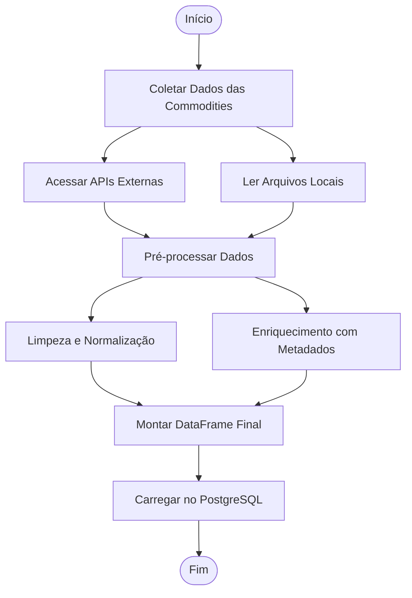

# README

## PROJECT DW DBT

## Project structure

```mermaid
flowchart TD;
    A([Início]) --> B[Coletar Dados das Commodities]
    
    %% Etapas paralelas na Extração
    B --> B1[Acessar APIs Externas]
    B --> B2[Ler Arquivos Locais]
    
    %% Ambas levam à próxima etapa
    B1 --> C[Pré-processar Dados]
    B2 --> C

    %% Transformação paralela
    C --> D1[Limpeza e Normalização]
    C --> D2[Enriquecimento com Metadados]

    D1 --> E[Montar DataFrame Final]
    D2 --> E

    %% Carga
    E --> F[Carregar no PostgreSQL]
    F --> G([Fim])
```