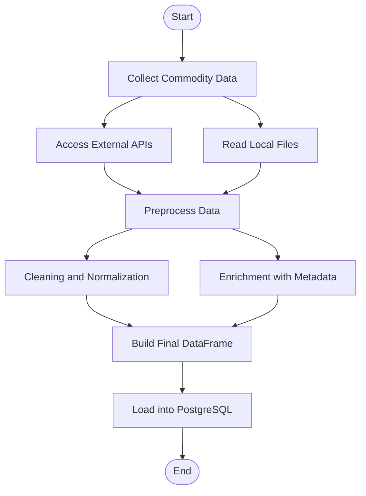

# README
## PROJECT DW DBT

This project demonstrates how to build a Data Warehouse using **dbt (Data Build Tool)**. It transforms and organizes raw data (from files and APIs) into a PostgreSQL database hosted on **AWS**, following data engineering best practices.

---

## Overview

The goal is to consolidate data from multiple sources, transform it with dbt, and make it available in a structured, reliable way using PostgreSQL on the cloud. The project is designed to be scalable, reusable, and easy to maintain.

---

## Tech Stack

- **dbt** – for data modeling and transformations  
- **PostgreSQL** – data warehouse hosted on **AWS**  
- **Python** – for data extraction and preprocessing  
- **Git** – for version control  

---

## 📁 Project Structure

```bash
project_dw_dbt/
├── app/                   # Python scripts for data collection and preprocessing
├── datawarehouse/         # dbt project folder
│   ├── models/            # dbt models (SQL transformations)
│   ├── seeds/             # Seed data in CSV format
│   ├── snapshots/         # (optional) Change tracking over time
│   └── dbt_project.yml    # dbt configuration file
├── logs/                  # Log files
├── src/                   # Source data (CSV, JSON, etc.)
├── profiles.yml           # dbt profile configuration
└── README.md              # This file :)

## Project structure
```



🙌 Credits
This project is inspired by a tutorial from Luciano Galvão on YouTube. It serves as a foundation for building Data Warehouses with dbt, PostgreSQL, and AWS. Thank you for the valuable content!