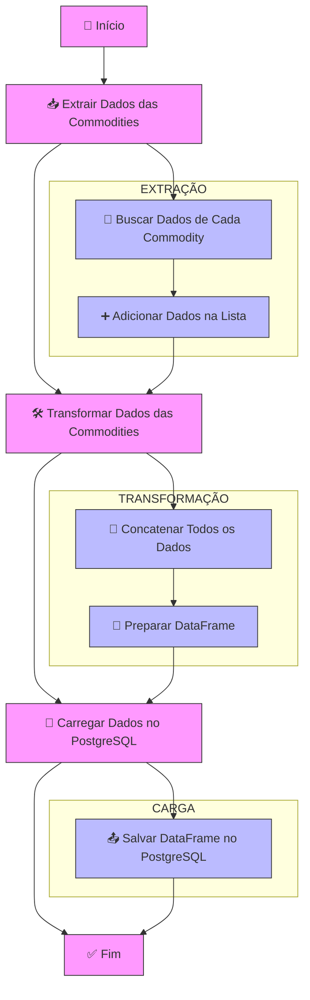

# PROJECT DW DBT

```mermaid
graph TD;
    %% Estilo
    classDef etapa fill:#f9f,stroke:#333,stroke-width:1px;
    classDef subetapa fill:#bbf,stroke:#333,stroke-width:1px;

    A[🎯 Início] --> B[📥 Extrair Dados das Commodities]
    B --> C[🛠️ Transformar Dados das Commodities]
    C --> D[💾 Carregar Dados no PostgreSQL]
    D --> E[✅ Fim]

    %% Subgrupos
    subgraph EXTRAÇÃO
        B1[🔎 Buscar Dados de Cada Commodity]
        B2[➕ Adicionar Dados na Lista]
    end

    subgraph TRANSFORMAÇÃO
        C1[🔗 Concatenar Todos os Dados]
        C2[🧹 Preparar DataFrame]
    end

    subgraph CARGA
        D1[📤 Salvar DataFrame no PostgreSQL]
    end

    %% Fluxo interno
    B --> B1 --> B2 --> C
    C --> C1 --> C2 --> D
    D --> D1 --> E

    %% Estilo das caixas
    class B,C,D,A,E etapa;
    class B1,B2,C1,C2,D1 subetapa;
```
Project Structure