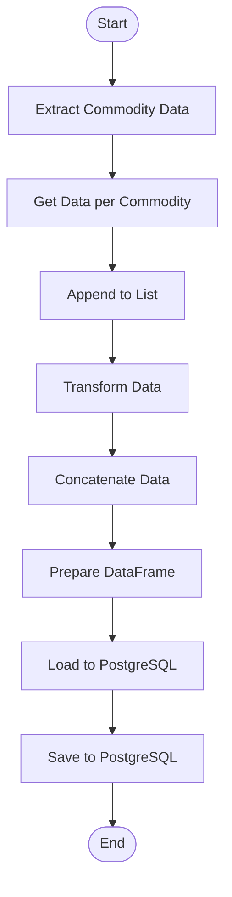

# PROJECT DW DBT

## Project structure

```mermaid
flowchart TD;
    Start([Start])
    Extract[Extract Commodity Data]
    Transform[Transform Data]
    Load[Load to PostgreSQL]
    End([End])

    Start --> Extract
    Extract --> Extract1[Get Data per Commodity]
    Extract1 --> Extract2[Append to List]
    Extract2 --> Transform
    Transform --> Transform1[Concatenate Data]
    Transform1 --> Transform2[Prepare DataFrame]
    Transform2 --> Load
    Load --> Load1[Save to PostgreSQL]
    Load1 --> End
```
Project Structure