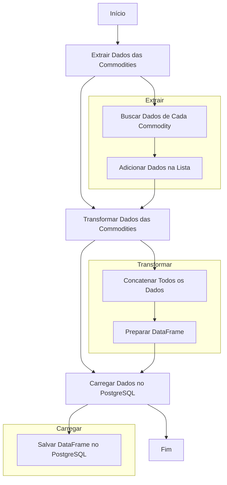



#DBT-Core project ro Data Warehouse of Commodities

This project uses dbt (data build tool) to manage and to transform data
from a commodities Data Warehouse. The goal  is to make a data pipeline efficient
that organize and transform commodities data and transaction to analysis.

## Project Structure




### 1. Seeds

### 2. Models

#### Staging

```plaintext
├── models
│   ├── staging
│   │   ├── stg_commodities.sql
│   │   └── stg_movimentacao_commodities.sql
│   └── datamart
│       └── dm_commodities.sql
├── seeds
│   └── movimentacao_commodities.csv
├── dbt_project.yml
└── README.md
```

#### Staging


- **stg_commodities.sql**

- **stg_movimentacao_commodities.sql**

#### Datamart


